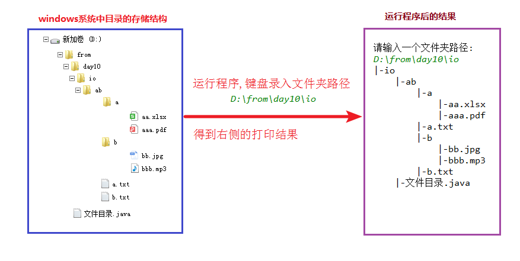
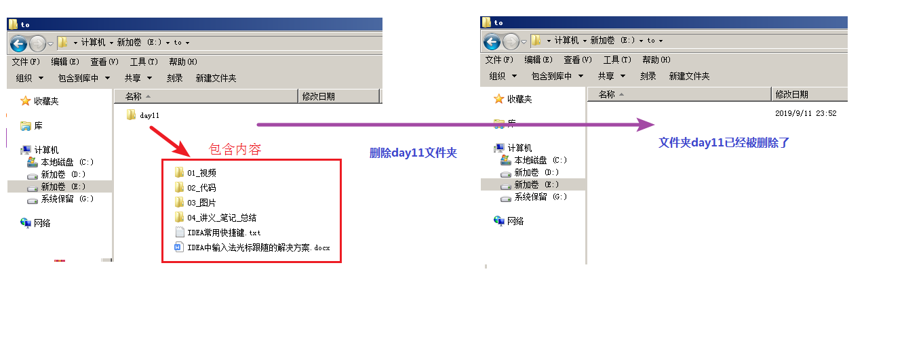

# day11IO流

# 知识点

## 题目1（加强训练）

```
不死神兔
故事得从西元1202年说起，话说有一位意大利青年，名叫斐波那契。
在他的一部著作中提出了一个有趣的问题：假设一对刚出生的小兔一个月后就能长成大兔，再过一个月就能生下一对小兔，并且此后每个月都生一对小兔，一年内没有发生死亡
问：一对刚出生的兔子，一年内繁殖成多少对兔子?
```

### 训练目标

能够使用递归解决不死神兔问题。

### 训练提示

1、什么是递归？

2、递归调用的出口是什么？

3、递归调用的规律是什么？

### 参考方案

找出递归调用的出口和规律,定义方法递归调用,调用方法传递数字12。

### 操作步骤

1、定义方法getCount,根据月数(int数字month)获取兔子对数
        1.1、 判断如果month的值是1或者2,直接返回1
        1.2、 否则递归调用getCount方法分别传递month-1和month-2,累加求和并返回
2、创建Scanner对象
3、获取int数字代表月份
4、调用getCount方法传递月份,获取结果并输出


### 参考答案

```java
public class Test01 {    
    //1、定义方法getCount,根据月数(int数字month)获取兔子对数
    public static int getCount(int month) {
        //1.1、 判断如果month的值是1或者2,直接返回1
        if(month == 1 || month == 2) {
            return 1;
        }
        //1.2、 否则递归调用getCount方法分别传递month-1和month-2,累加求和并返回
        return getCount(month - 2) + getCount(month - 1);        
    }
    public static void main(String[] args) {
        //2、创建Scanner对象
        Scanner sc = new Scanner(System.in);
        System.out.println("请输入int数字,代表月份: ");
        //3、获取int数字代表月份
        int month = sc.nextInt();
        //4、调用getCount方法传递月份,获取结果并输出
        int count = getCount(month);
        System.out.println("一年内繁殖成 "+count+" 对兔子");
    }
	
}

```

### 视频讲解

另附avi格式视频。


## 题目2（加强训练）

```
windows资源管理器中会展示目录中的内容结构,但是java并没有提供展示目录结构的操作,本案例完成按照指定格式打印文件夹的目录结构(包含子文件夹和文件),效果如下图:
```



### 训练目标

能够利用方法的递归调用,打印文件夹目录结构。

### 训练提示

1、什么是递归？

2、递归调用的出口是什么？

3、递归调用的规律是什么？

### 参考方案

定义方法,按照要求打印目录结果,再调用方法传递文件夹File对象。

### 操作步骤

1、定义打印文件/文件夹名称的方法printFileName	
    	1.1、for循环打印num个制表符tab(java中用"\t"表示),不带换行
    	1.2、打印File对象名称,前面拼接|-,需要换行
2、定义打印文件夹方法printDir	
        2.1、 调用printFileName方法打印文件夹名称
        2.2、 获取源文件夹中的所有的文件和文件夹对应的File对象数组
        2.3、 判断,如果File对象数组是null或者没有内容,结束方法
        2.4、 遍历File对象数组
        2.5、 判断,如果当前File对象是文件,调用printFileName方法,打印文件名称
        2.6 、判断,如果当前File对象是文件夹,递归调用printDir方法
3、创建被遍历文件夹的File对象
4、调用printDir方法,传递源文件夹和0,完成文件夹目录结构的打印

### 参考答案

```java
public class Test02 {
    //1、定义打印文件/文件夹名称的方法printFileName
    public static void printFileName(int num,File file) {
        //1.1、for循环打印num个制表符tab(java中用"\t"表示),不带换行
        for (int i = 0; i < num; i++) {
            System.out.print("\t");
        }
        //1.2、打印File对象名称,前面拼接|-,需要换行
        System.out.println("|-"+file.getName());

    }
    //2、定义打印文件夹方法printDir	
    public static void printDir(File dir,int num) {
        //2.1、 调用printFileName方法打印文件夹名称
        printFileName(num,dir);
        num++;
		//2.2、 获取源文件夹中的所有的文件和文件夹对应的File对象数组
        File[] files = dir.listFiles();
        //2.3、 判断,如果File对象数组是null或者没有内容,结束方法
        if (files == null || files.length ==0) {
            //直接返回length
            return;
        }
        //2.4、 遍历File对象数组
        for (File file : files) {
            //2.5、 判断,如果当前File对象是文件
            if(file.isFile()) {
                //调用printFileName方法,打印文件名称
                printFileName(num,file);                
            }
            //2.6、 判断,如果当前File对象是文件夹,递归调用printDir方法
            if(file.isDirectory()) {
                printDir(file,num);
            }
        }
    }    
    public static void main(String[] args) {       
        //3、创建被遍历文件夹的File对象
        File dir = new File("...");
        printDir(dir,0);
    }    
}
```

### 视频讲解

另附avi文件提供。


## 题目3（综合扩展）

在windows操作系统中可以查看文件夹的大小,直接右键文件夹/属性,如下图:
但是在java中没有提供直接查看文件夹大小的操作,请使用File类和IO流的相关知识,计算文件夹的大小。
要求通过键盘录入文件夹路径(必须保证该文件夹路径是存在的)

### 

### 训练目标

能够使用递归调用定义方法,计算文件夹的大小。

### 训练提示

1、该方法是否需要返回值?

2、递归调用的出口是什么？

3、递归调用的规律是什么？

### 参考方案

定义方法,计算文件夹大小,再调用方法传递文件夹File对象。

### 操作步骤       

1、定义获取文件夹大小的方法getSize
	1.1、定义long类型变量size,累加长度,初始值0
    	1.2、方法参数File类型对象dir,调用listFiles方法,获取File对象数组files
    	1.3、判断如果数组files为null或者长度为0,直接返回size
    	1.4、遍历File对象数组files
    	1.5、 判断如果当前File对象是文件,把文件大小累加到变量size中
    	1.6、 判断如果当前File对象是文件夹,递归调用getSize方法,传递当前File对象做参数,并把方法返回结果累加到size中
    	1.7 、循环结束返回size
	
2、创建File对象dir,代表存在的文件夹
3、调用获取文件夹大小的方法getSize,传递File对象dir,获取文件夹大小
4、输出文件夹大小   

### 参考答案

```java
import java.io.File;
import java.util.Scanner;

public class Test03 {
     //1、定义获取文件夹大小的方法getSize
    public static long getSize(File dir) {
        //1.1、定义long类型变量size,累加文件长度,初始值0
        long size = 0;
        //1.2、方法参数File类型对象dir,调用listFiles方法,获取File对象数组files
        File[] files = dir.listFiles();
        //1.3、判断如果数组files为null或者长度为0
        if (files == null || files.length ==0) {
            //直接返回size
            return size;
        }
        //1.4、遍历File对象数组files
        for (File file : files) {
            //1.5、判断如果当前File对象是文件
            if(file.isFile()) {
                //把文件大小累加到变量size中
                size += file.length();
            }
            //1.6、判断如果当前File对象是文件夹
            if(file.isDirectory()) {
                //递归调用getSize方法,传递当前File对象做参数,并把方法返回结果累加到size中
                size += getSize(file);
            }
        }
        //1.7、循环结束返回size
        return size;
    }
    public static void main(String[] args) {
        //2、创建File对象dir,代表存在的文件夹
        File dir = new File("...");

        //3、调用获取文件夹大小的方法getSize,传递File对象dir,获取文件夹大小
        long length = getSize(dir);

        //4、输出文件夹大小
        System.out.println("大小: "+size+" 字节");
    }

}

```

### 视频讲解

另附avi文件提供。

### 

## 题目4（综合扩展）

windows操作系统中可以进行文件夹的删除,比如删除E:\\to\\day11文件夹,但是java没有提供直接删除文件夹的方法。

请编写程序实现文件夹的删除。效果如下图：



### 训练目标

能够使用递归调用定义方法,删除文件夹。

### 训练提示

1、该方法是否需要返回值?

2、递归调用的出口是什么？

3、递归调用的规律是什么？

### 参考方案

定义方法,删除文件夹,再调用方法传递文件夹File对象。

### 操作步骤  

 1、定义删除文件夹的方法deleteDir

	1.1、获取源文件夹中的所有的文件和文件夹对应的File对象数组
	    1.2、判断,如果File对象数组是null或者没有内容,删除目录,结束方法
	    1.3、遍历File对象数组
	    1.4、判断,如果当前File对象是文件,调用delete方法,删除文件
	    1.5、判断,如果当前File对象是文件夹,递归调用调用deleteDir方法,传递当前File对象
	    1.6、循环结束,删除调用方法传递的文件夹File对象  

2、创建File对象dir,代表存在的文件夹
3、调用步骤一中定义的deleteDir方法,传递File对象dir,完成文件夹的删除

### 参考答案

```java
import java.io.File;
import java.util.Scanner;

public class Test04 {
    //1、定义删除文件夹的方法deleteDir
    public static boolean deleteDir(File dir) {
        //1.1、获取源文件夹中的所有的文件和文件夹对应的File对象数组
        File[] files = dir.listFiles();
        //1.2、判断,如果File对象数组是null或者没有内容,删除目录,结束方法
        if(files==null || files.length==0) {
            //如果dir中没内容,直接删除
            return dir.delete();
        }
        //1.3、遍历File对象数组
        for (File file : files) {
            //1.4、判断,如果当前File对象是文件,调用delete方法,删除文件
            if(file.isFile()) {
                //删除该文件
                file.delete();
            }
            //1.5、判断,如果当前File对象是文件夹,递归调用调用deleteDir方法,传递当前File对象
            if(file.isDirectory()) {
                //递归调用
                deleteDir(file);
            }
        }
        //1.6、循环结束,删除调用方法传递的文件夹File对象
        return dir.delete();
    }
    public static void main(String[] args)  throws IOException {
        //2、创建File对象dir,代表存在的文件夹
        File dir = new File("...");
        //3、调用步骤一中定义的deleteDir方法,传递File对象dir,完成文件夹的删除
        deleteDir(dir);
    }
}
```

### 视频讲解

另附avi文件提供。


